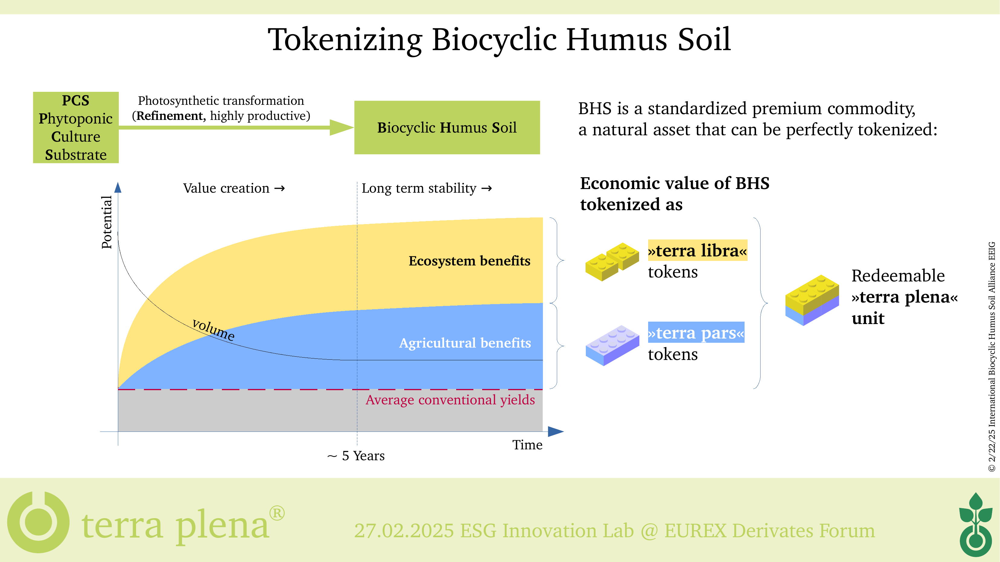
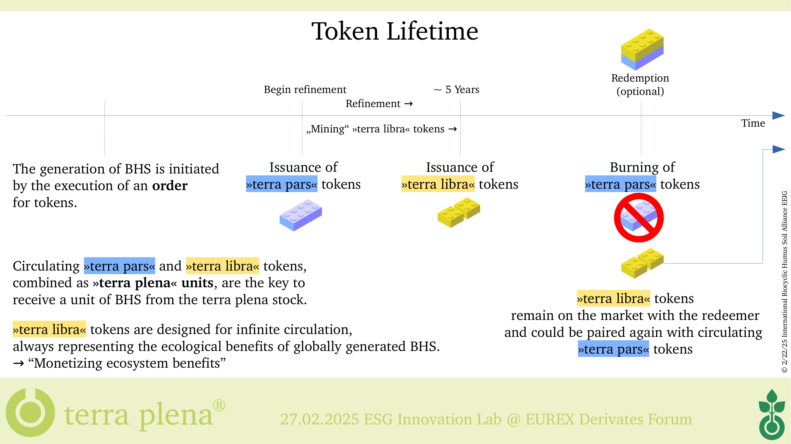

# Money Supply in Terms of Stability - Working Draft

## Regenerative Real-World Asset Tokenization Using the Example of Biocyclic Humus Soil (The »terra plena Project«)

### Hypothesis

*A stable economy depends on the availability of monetary units that are aligned with the potential provision of ecosystem services.*

### Derivation

Assuming a stable and healthy ecosystem is a prerequisite for economic activity, economic profit cannot be achieved by decreasing ecosystem potential or stability.

#### Measurement

Economic profit is measured in balance sheets and expressed in units of the used currency.

If the currency units used do not align with the ecosystem's potential, profits may be reported even though losses occurred by exploiting or decreasing the ecosystem.

This measurement issue is causing an unstable economy by creating the illusion of economic profit when, in reality, degradation is taking place. It contributes to systemic instability.

Without a currency that reflects the ecosystem service potential, we lack a reliable measure of true economic value.

#### Self-destructive activity

This measurement issue creates the perception of profitability, which incentivizes further degradation. Ultimately, this destabilizes ecosystems and the economy itself.

### Target

In order to preserve ecological and economic stability, it is urgent that the issuance of monetary units must be directly tied to verifiable **regenerative** outcomes of ecosystems.

The term "regenerative" is emphasized because simply measuring or evaluating existing conditions is not enough. Only activities that measurably increase ecological service potential and resilience can contribute to long-term stabilization and economic growth.

### Gap in Current Research

To date, there appears to be no empirical or theoretical study that investigates the systemic effects of non-ecologically coupled monetary issuance on long-term ecological stability. This lack of attention creates a blind spot in both macroeconomic policy and ecological modeling.

While some studies address green investments, externalized costs, or degrowth theories, they do not explore the fundamental question of whether the nature of money issuance itself has ecologically destructive effects.

This gap presents a critical opportunity for interdisciplinary research bridging monetary economics and ecological sustainability in terms of stability.

### Approach

We propose a model of regenerative real-world asset tokenization, in which the issuance of monetary units is directly tied to verifiable ecological regeneration.
In contrast to conventional systems that rely on debt or resource extraction, this model uses measurable improvements in ecosystem service potential – such as the generation of Biocyclic Humus Soil – as the sole and supply-limiting basis for monetary issuance.

Public blockchains provide an ideal technological framework for implementing and auditing such models, due to their transparency, immutability, and decentralized nature.

While most economic models assume a homogeneous and closed monetary system, real-world applications must operate in heterogeneous and overlapping economic contexts. This highlights the need for new analytical frameworks capable of evaluating the performance and systemic impact of regenerative currencies within complex, multi-system environments.

### Use Case: The »terra plena Project«

The *terra plena project* tokenizes the generation of Biocyclic Humus Soil as a measurable and verifiable ecosystem service potential.

This unique form of soil – developed under the scientific leadership of Dr. agr. Johannes Eisenbach – is a standardized substrate that fulfills all essential criteria to function as a regenerative asset within a monetary framework:

- It results from natural biological processes, not industrial transformation.
- Its generation requires active human engagement (economic activity), including the management of organic matter, optimization of environmental conditions, and continuous care.
- It simultaneously enhances economic value (e.g., crop yields, soil fertility) and ecological value (e.g., biodiversity, climate resilience, carbon retention).

Each kilogram of Biocyclic Humus Soil generated under controlled and independently verifiable conditions corresponds to a terra plena token unit. Each unit is redeemable against physical soil and auditable, ensuring trust and transparency in its backing.

To accurately represent both **individual utility** and **collective regenerative value**, the terra plena system employs a dual-token architecture:

- terra pars – a unit of exchange, representing the agricultural utility of the soil (individual economic benefit)
- terra libra – a proof-of-regeneration token, representing the verified ecological contribution (collective economic benefit)

*Figure: Tokenization of Biocyclic Humus Soil (terra plena project)*

*Figure: Token Lifecycle – From Issuance to Ecological Accounting*

This structure enables a clear distinction between functional value – what can be utilized by an individual – and regenerative value – what has been contributed to the collective benefit and ecosystem stability.
It introduces a transparent accounting system for ecosystem-based monetary issuance.

In contrast, traditional accounting systems reflect only individual economic gains. The collective ecological improvements remain untracked and economically invisible.

### Effects and Benefits

The creation of ecological monetary units incentivizes ecosystem regeneration over exploitation.  This establishes a new benchmark for assessing economic stability in ecological terms, aligning money supply with ecological service potential.

Key benefits of this approach include:

- **Revaluation of ecosystem services**: Ecosystems are no longer treated as externalities but become integral components of economic accounting.

- **Stabilization through regenerative feedback**: Currency issuance becomes self-limiting and stabilizing, as it is directly tied to verified regenerative outcomes.

- **Incentivized behavior change**: Economic actors are rewarded not for resource depletion, but for measurable contributions to ecosystem health.

- **Decoupling from extractive collateral**: Monetary value is no longer based on finite or destructive assets, but on regenerative potential – offering a dynamic and expanding foundation for economic growth, in contrast to the inherent limitations of the current monetary paradigm, which constrains long-term ecological regeneration and stable economic development.

- **Global scalability**: The model is adaptable to various ecosystems and service types, making it applicable across diverse environmental and socio-economic contexts.

Ultimately, such a system has the potential to realign the foundations of economic value with the principles of ecological regeneration, offering a pathway toward **systemic sustainability and macroeconomic stability**.

### Research Outlook and Future Contributions

This paper outlines key questions and areas for interdisciplinary exploration, including:

- **Identification of regenerative economic activities**:  
  Which forms of human activity measurably increase ecosystem service potential while also contributing to economic value creation?

- **Development of abstract tokenization frameworks**:  
  How can we design generalizable models for issuing tokens that represent ecosystem services which also qualify as collective economic benefits?

- **Standardization and large-scale verification of regenerative impact**:  
  How can regenerative outcomes be standardized and verified across contexts?  
  Could a higher-level aggregation of regenerative currencies lead to a unified meta-framework for "regenerative money"?

- **Integration into monetary policy**:  
  What mechanisms would allow policymakers and central banks to incorporate ecosystem-backed currencies into existing monetary systems?

This model invites economists, ecologists, technologists, and policymakers to jointly reconsider the foundations of value – contributing to a regenerative monetary future embedded in the wider discourse on sustainable finance, ecological macroeconomics, and systemic resilience.

## How to contribute

Feedback, suggestions, and pull requests are welcome.  
If you are interested in collaborating on a workshop submission or further development of this idea, feel free to contact me or open an issue.
